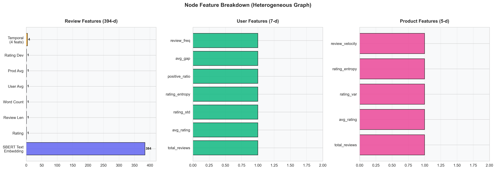
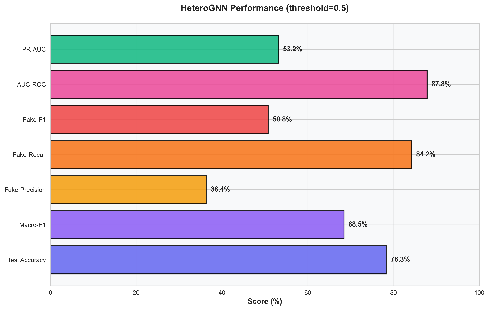
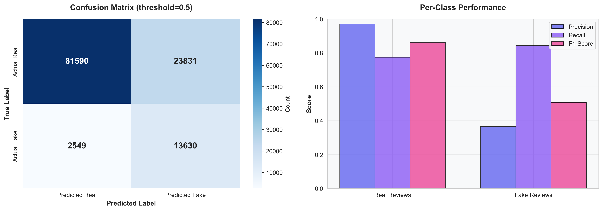
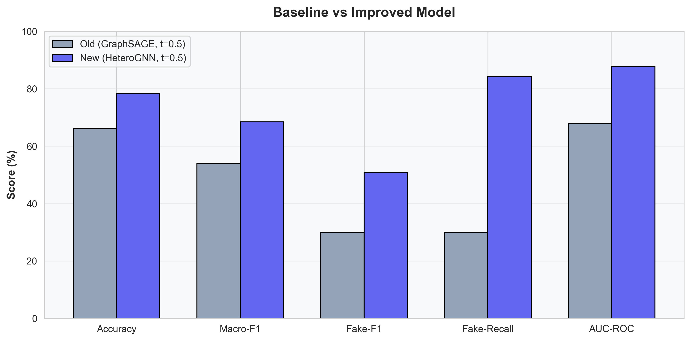
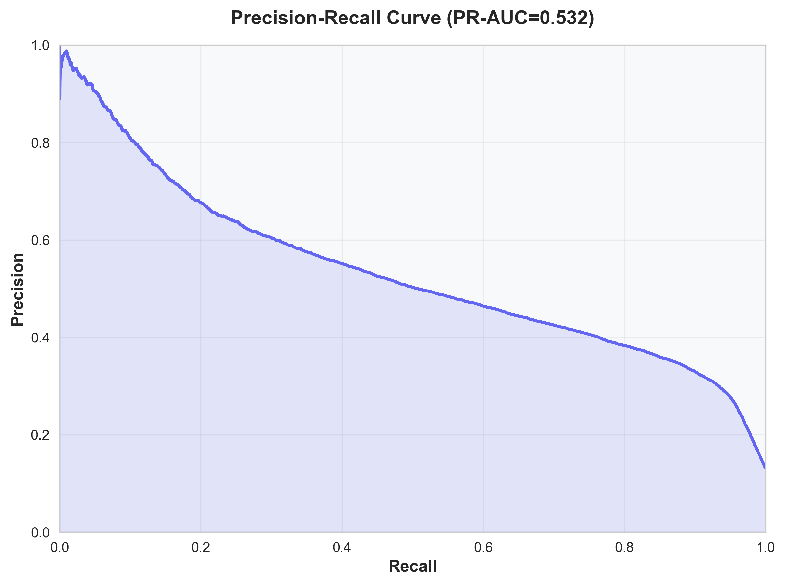
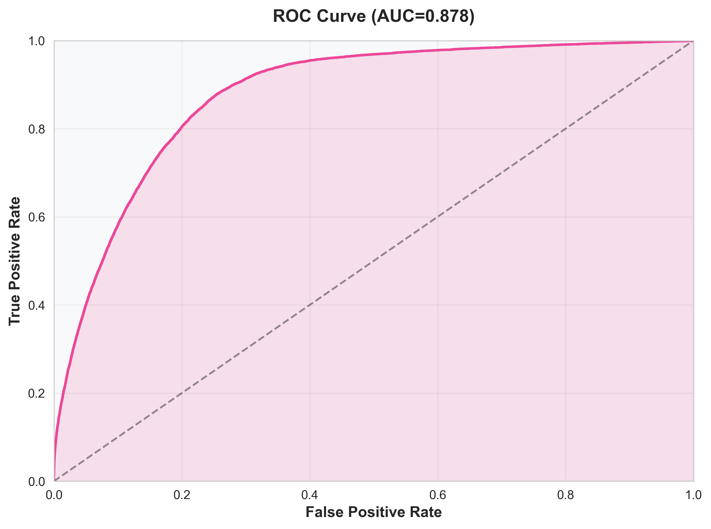
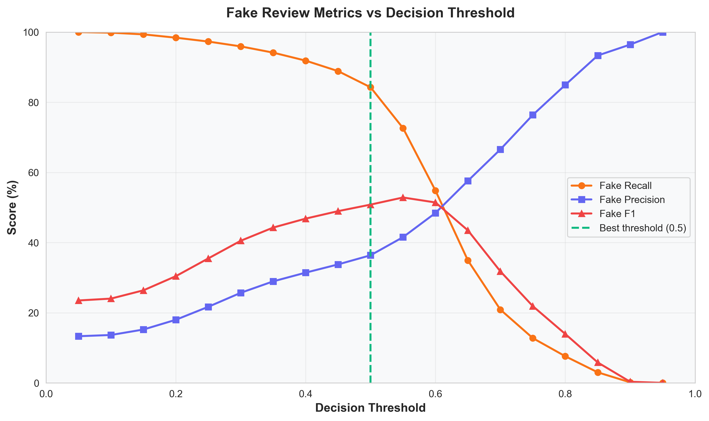
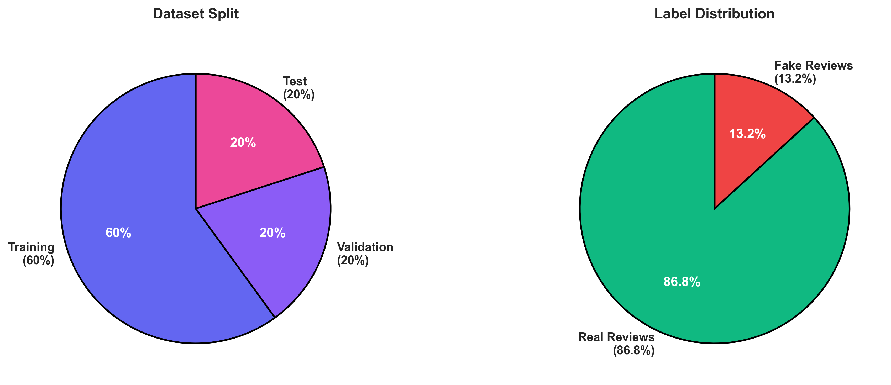
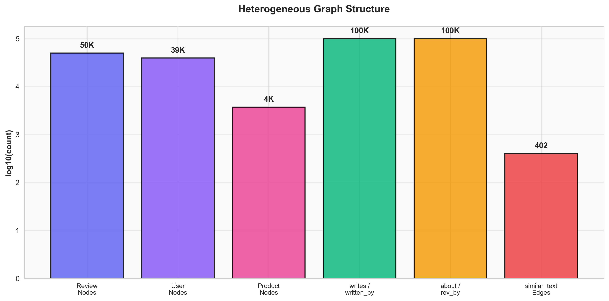

# Heterogeneous Graph Neural Network for Fraudulent Review Detection

A production-grade system that detects **fake Yelp reviews** using a Heterogeneous Graph Neural Network (HeteroGNN). The system models the relationships between **Users**, **Reviews**, and **Products** as a typed graph, then applies graph-based deep learning to classify reviews as Real or Fake — capturing patterns that traditional text-only classifiers miss.

This README is a complete technical walkthrough: from the machine learning fundamentals that underpin every component, through the graph neural network theory, to the exact implementation details and experimental results.

---

## Table of Contents

1. [The Problem: Why Fake Review Detection Is Hard](#1-the-problem-why-fake-review-detection-is-hard)
2. [Background: Machine Learning Fundamentals](#2-background-machine-learning-fundamentals)
   - [2.1 Supervised Classification](#21-supervised-classification)
   - [2.2 Neural Networks](#22-neural-networks)
   - [2.3 Deep Learning Concepts](#23-deep-learning-concepts)
   - [2.4 Class Imbalance](#24-class-imbalance)
3. [Background: Graph Neural Networks from Scratch](#3-background-graph-neural-networks-from-scratch)
   - [3.1 Why Graphs?](#31-why-graphs)
   - [3.2 Graph Representation](#32-graph-representation)
   - [3.3 Message Passing Framework](#33-message-passing-framework)
   - [3.4 GraphSAGE](#34-graphsage)
   - [3.5 Heterogeneous Graphs](#35-heterogeneous-graphs)
   - [3.6 HeteroConv](#36-heteroconv)
4. [System Architecture](#4-system-architecture)
   - [4.1 Pipeline Overview](#41-pipeline-overview)
   - [4.2 Graph Construction](#42-graph-construction)
   - [4.3 Feature Engineering](#43-feature-engineering)
   - [4.4 Model Architecture](#44-model-architecture)
   - [4.5 Loss Function: Focal Loss](#45-loss-function-focal-loss)
5. [Techniques for Improving Fake Detection](#5-techniques-for-improving-fake-detection)
   - [5.1 Decision Threshold Tuning](#51-decision-threshold-tuning)
   - [5.2 Class-Balanced Mini-Batch Sampling](#52-class-balanced-mini-batch-sampling)
   - [5.3 Hard Example Mining](#53-hard-example-mining)
   - [5.4 Burst Detection Temporal Features](#54-burst-detection-temporal-features)
   - [5.5 Review Similarity Edges](#55-review-similarity-edges)
   - [5.6 Focal Loss](#56-focal-loss)
   - [5.7 Larger Dataset Training](#57-larger-dataset-training)
6. [Experimental Results](#6-experimental-results)
7. [Evaluation Metrics Explained](#7-evaluation-metrics-explained)
8. [Visualizations](#8-visualizations)
9. [Web Application](#9-web-application)
10. [Quick Start & Usage](#10-quick-start--usage)
11. [Project Structure](#11-project-structure)
12. [Configuration Reference](#12-configuration-reference)
13. [Dataset](#13-dataset)
14. [Technical Stack](#14-technical-stack)
15. [Future Improvements](#15-future-improvements)

---

## 1. The Problem: Why Fake Review Detection Is Hard

Online reviews shape purchasing decisions for millions of consumers. Studies estimate that **16–30% of online reviews are fraudulent** — either fake positives (paid to boost a product) or fake negatives (paid to harm a competitor). Detecting them is difficult because:

- **Textual mimicry**: Sophisticated fake reviews are written to sound genuine. Simple keyword or sentiment analysis fails because fakes deliberately copy the style of real reviews.
- **Class imbalance**: In the Yelp dataset, only **13.2% of reviews are fake**. A naive classifier that always predicts "Real" would achieve 86.8% accuracy — but catch zero fakes.
- **Relational signals**: A single review in isolation may look legitimate. Fraud becomes visible only when you examine **patterns across users and products** — the same user posting 20 reviews in one hour, or dozens of similarly-worded reviews appearing on the same product overnight.
- **Evolving tactics**: Fraudsters adapt. Static rule-based systems are quickly circumvented.

**Our approach**: Model the entire ecosystem as a **graph** — Users connected to the Reviews they write, Reviews connected to the Products they discuss, and Reviews connected to other Reviews with similar language. Then apply a Graph Neural Network that can learn from all these relational patterns simultaneously.

---

## 2. Background: Machine Learning Fundamentals

This section explains the core ML/DL concepts used in this project, starting from the very basics.

### 2.1 Supervised Classification

**Supervised learning** is the task of learning a function `f(x) → y` from labeled training data, where `x` is an input (features) and `y` is the desired output (label).

In **binary classification**, the label is one of two classes. For us:
- `y = 0` → Real review
- `y = 1` → Fake review

The model learns to map a **feature vector** (a numerical representation of a review, its author, and its product context) to a probability: `P(Fake | features)`.

**Key concepts**:
- **Training set**: Labeled data the model learns from (60% of our data)
- **Validation set**: Held-out data used to tune hyperparameters and prevent overfitting (20%)
- **Test set**: Final unseen data used to report performance — never used during training (20%)
- **Overfitting**: When a model memorizes training data but fails on new data. We combat this with dropout, early stopping, and regularization.

### 2.2 Neural Networks

A **neural network** is a function composed of layers of linear transformations followed by non-linear activations.

**Single neuron** (the building block):
```
output = activation( w₁·x₁ + w₂·x₂ + ... + wₙ·xₙ + bias )
```

Where:
- `x₁...xₙ` are inputs (features)
- `w₁...wₙ` are **learnable weights** — the model adjusts these during training
- `bias` is a learnable offset
- `activation` is a non-linear function (e.g., ReLU: `max(0, x)`)

**Why non-linearity?** Without activations, stacking linear layers just produces another linear function. Non-linearities allow the network to learn complex, non-linear decision boundaries — essential for real-world tasks like fraud detection.

**A layer** = many neurons operating in parallel, expressed as a matrix multiplication:
```
h = ReLU(W · x + b)
```
Where `W` is a weight matrix (e.g., 397×128), `x` is the input vector (397-d), and `h` is the output (128-d).

**A deep network** = multiple layers stacked:
```
Input (397-d) → Linear(397→128) → ReLU → Linear(128→64) → ReLU → Linear(64→2) → Softmax
```

Each layer transforms the representation into a progressively more abstract and task-relevant form.

### 2.3 Deep Learning Concepts

**Loss function**: A mathematical measure of how wrong the model's predictions are. The model's goal is to minimize this. For classification, **Cross-Entropy Loss** is standard:
```
L = -[y · log(p) + (1-y) · log(1-p)]
```
Where `y` is the true label and `p` is the predicted probability. This penalizes confident wrong predictions heavily.

**Backpropagation**: The algorithm that computes how much each weight contributed to the loss, using the chain rule of calculus. It propagates the error gradient backward through the network.

**Gradient descent**: After computing gradients, each weight is updated:
```
w_new = w_old - learning_rate × gradient
```
The **learning rate** (lr=0.001 in our case) controls the step size. Too large → unstable training. Too small → slow convergence.

**Adam optimizer**: An advanced variant of gradient descent that maintains per-parameter adaptive learning rates and momentum. It converges faster and more reliably than vanilla gradient descent.

**Dropout** (p=0.3): During training, randomly sets 30% of neuron outputs to zero at each forward pass. This prevents co-adaptation of neurons and acts as regularization, reducing overfitting.

**Batch Normalization**: Normalizes the activations within each layer to have zero mean and unit variance. Stabilizes training and allows higher learning rates.

**Early stopping**: We monitor validation Macro-F1 after each epoch. If it doesn't improve for 15 consecutive epochs (patience=15), training stops. This prevents overfitting.

**Learning rate scheduling** (ReduceLROnPlateau): If validation performance plateaus for 7 epochs, the learning rate is halved. This allows fine-grained convergence in later training stages.

### 2.4 Class Imbalance

Our dataset is **heavily imbalanced**: 86.8% Real vs 13.2% Fake. This creates critical problems:

| Problem | Effect |
|---------|--------|
| **Majority-class bias** | The model learns to always predict "Real" because it's right 86.8% of the time |
| **Gradient domination** | The loss gradient is dominated by the 86.8% real reviews; the model barely learns from the 13.2% fake ones |
| **Misleading accuracy** | 86.8% accuracy sounds good, but it means zero fake reviews were caught |

**Solutions we employ** (each explained in detail in Section 5):
1. **Focal Loss** — re-weights the loss to focus on hard-to-classify samples
2. **Balanced mini-batch sampling** — each training batch is 50% fake, 50% real
3. **Decision threshold tuning** — instead of 0.5, classify as fake if P(Fake) > 0.3
4. **Hard example mining** — increase sampling probability for frequently misclassified reviews

---

## 3. Background: Graph Neural Networks from Scratch

### 3.1 Why Graphs?

Traditional ML treats each data point independently — a review is a feature vector, classified in isolation. But fraud detection is **inherently relational**:

- A user who posts 50 reviews in one day is suspicious **because of the pattern across their reviews**
- A product that receives 30 nearly identical reviews is suspicious **because of the similarity across reviews**
- A user who only reviews products that other known fake reviewers also review is suspicious **because of the shared neighborhood**

**Graphs** are the natural data structure for relational data:
- **Nodes** represent entities (Users, Reviews, Products)
- **Edges** represent relationships (User writes Review, Review is about Product)
- **Node features** encode properties of each entity
- **Graph structure** encodes how entities are connected

A **Graph Neural Network (GNN)** is a neural network that operates directly on graph-structured data, learning from both node features AND graph topology.

### 3.2 Graph Representation

Formally, a graph `G = (V, E)` consists of:
- `V` = set of nodes (vertices), each with a feature vector `x_v`
- `E` = set of edges connecting pairs of nodes

In our system:
```
V = { all review nodes } ∪ { all user nodes } ∪ { all product nodes }
E = { writes, written_by, about, rev_by, similar_text }
```

The graph is stored as an **adjacency list** (edge_index in PyTorch Geometric): two lists of node indices representing source and destination of each edge. For 50,000 reviews:

| Edge type | Meaning | Count |
|-----------|---------|-------|
| `(user) → writes → (review)` | User authored this review | 50,000 |
| `(review) → written_by → (user)` | Reverse of writes | 50,000 |
| `(review) → about → (product)` | Review discusses product | 50,000 |
| `(product) → rev_by → (review)` | Reverse of about | 50,000 |
| `(review) → similar_text → (review)` | Cosine similarity > 0.8 | 45,140 |

### 3.3 Message Passing Framework

The core idea behind all GNNs is **message passing**: each node updates its representation by aggregating information from its neighbors.

One round of message passing:
```
1. MESSAGE:    For each neighbor j of node i, compute a message m_j→i
2. AGGREGATE:  Combine all incoming messages: M_i = AGG({m_j→i : j ∈ neighbors(i)})
3. UPDATE:     Compute new representation: h_i' = UPDATE(h_i, M_i)
```

**Intuition**: After one round, each node "knows about" its immediate neighbors. After two rounds, it knows about neighbors-of-neighbors (2-hop). After K rounds, information from K-hop neighborhoods has been propagated.

**Why this works for fraud detection**: After 2 layers, a review node has received information from:
- The **user** who wrote it (1-hop via `written_by`)
- Other **reviews** by the same user (2-hop: review → user → review)
- The **product** it reviews (1-hop via `about`)
- Other **reviews** of the same product (2-hop: review → product → review)
- **Similar reviews** by text (1-hop via `similar_text`)

This means the classifier sees the full behavioral context — not just the review text in isolation.

### 3.4 GraphSAGE

**GraphSAGE** (SAmple and agGrEgate) is the specific GNN convolution we use. For each node `v`, it computes:

```
h_v^(k) = σ( W · CONCAT( h_v^(k-1), MEAN({ h_u^(k-1) : u ∈ N(v) }) ) )
```

Where:
- `h_v^(k)` is node v's representation at layer k
- `N(v)` is the set of neighbors of v
- `MEAN` aggregates neighbor representations
- `W` is a learnable weight matrix
- `σ` is a non-linear activation (ReLU)
- `CONCAT` combines the node's own representation with the aggregated neighbor representation

**Why GraphSAGE?**
- **Inductive**: Can generalize to unseen nodes (important for the web app where new reviews are added)
- **Scalable**: Uses sampling, avoiding full neighborhood expansion
- **Expressive**: Learned aggregation weights, not fixed

### 3.5 Heterogeneous Graphs

A **homogeneous graph** has one type of node and one type of edge. A **heterogeneous graph** has **multiple node types and/or edge types**.

Our graph is heterogeneous:
- **3 node types**: User, Review, Product — each with different feature dimensions and semantics
- **5 edge types**: writes, written_by, about, rev_by, similar_text — each representing a different relationship

Why does this matter? A "writes" edge (user→review) has completely different semantics from a "similar_text" edge (review→review). Using separate learned transformations for each edge type allows the model to learn **type-specific message functions**.

For example:
- On a `writes` edge, the model might learn to propagate "how prolific this user is" to their reviews
- On a `similar_text` edge, the model might learn to propagate "this cluster of reviews has coordinated language"

### 3.6 HeteroConv

**HeteroConv** (from PyTorch Geometric) is a wrapper that applies **a separate GNN convolution per edge type**, then aggregates the results per node type.

```
For each edge type (src_type, rel, dst_type):
    messages = SAGEConv(h_src, edge_index)    ← separate learned weights per relation

For each node type:
    h_new = MEAN( messages from all incoming edge types )   ← aggregate across relations
```

In our model, HeteroConv wraps 5 separate SAGEConv instances — one for each edge type. This means the model learns 5 different ways to pass messages, specialized for each type of relationship.

**Architecture flow** (for one layer):

```
User features ───SAGEConv(writes)───────→ ↘
Review features ─SAGEConv(written_by)───→  → MEAN → new Review repr.
Product features ─SAGEConv(rev_by)──────→ ↗
Review features ─SAGEConv(similar_text)─→ ↗
```

And symmetrically for User and Product nodes receiving messages from Reviews.

---

## 4. System Architecture

### 4.1 Pipeline Overview

The system has three stages:

```
┌──────────────────────────────────────────────────────────────────┐
│  STAGE 1: PREPROCESSING  (src/preprocess.py)                     │
│                                                                  │
│  yelpzip.csv → Load & sample → SBERT embeddings → Temporal/     │
│  behavioral features → Build hetero graph → Save graph_data.pt   │
└──────────────────────┬───────────────────────────────────────────┘
                       ↓
┌──────────────────────────────────────────────────────────────────┐
│  STAGE 2: TRAINING  (src/train.py)                               │
│                                                                  │
│  Load graph → Build model → Balanced sampling → Train with       │
│  Focal Loss + hard example mining → Threshold sweep →            │
│  Save best_model.pt + metrics.json                               │
└──────────────────────┬───────────────────────────────────────────┘
                       ↓
┌──────────────────────────────────────────────────────────────────┐
│  STAGE 3: INFERENCE  (app/app.py)                                │
│                                                                  │
│  Load model + graph → Accept new review → SBERT encode →         │
│  Attach to graph → Forward pass → Threshold-based prediction     │
└──────────────────────────────────────────────────────────────────┘
```

### 4.2 Graph Construction

The preprocessing pipeline (`src/preprocess.py`) transforms raw tabular data into a **PyTorch Geometric HeteroData** object:

**Step 1: Data loading**
- Load `yelpzip.csv` (608,000 reviews, 260,090 users, 5,044 products)
- Stratified sampling to desired size (preserves class ratio)
- Assign contiguous integer IDs to users and products

**Step 2: Text embeddings**
- Encode every review text with **Sentence-BERT** (`all-MiniLM-L6-v2`)
- Produces a 384-dimensional dense vector per review
- Captures semantic meaning — "This restaurant was terrible" and "Awful food, would not return" get similar vectors despite different words

**Step 3: Temporal & behavioral features**
- Compute per-review burst detection features (Section 5.4)
- Compute per-user behavioral features (review frequency, rating patterns)
- Compute per-product features (rating distribution, review velocity)

**Step 4: Edge construction**
- **Structural edges**: User↔Review (writes/written_by), Review↔Product (about/rev_by) — directly from the data
- **Similarity edges**: Review↔Review where SBERT cosine similarity > 0.8 — captures coordinated language

**Step 5: Split & save**
- Random 60/20/20 train/val/test split (stratified, seed=42)
- Save as `processed/graph_data.pt`

### 4.3 Feature Engineering

Each node type has its own feature vector, carefully designed to capture fraud signals:



#### Review Features (397-d)

| Feature Group | Dim | Description |
|--------------|-----|-------------|
| **SBERT text embedding** | 384 | Sentence-BERT `all-MiniLM-L6-v2` semantic representation of the review text. Captures meaning, tone, and writing style in a dense vector. |
| **Rating (normalized)** | 1 | Star rating divided by 5. Extreme ratings (1 or 5) are more common in fake reviews. |
| **Review length** | 1 | Character count, normalized. Fake reviews tend to be unusually short or unusually long. |
| **Word count** | 1 | Token count, normalized. Complements character length (captures verbose vs. terse). |
| **User average rating** | 1 | Mean rating of all reviews by this user. Users with extreme averages (all 5s or all 1s) are suspicious. |
| **Product average rating** | 1 | Mean rating of all reviews for this product. Context for how unusual this review's rating is. |
| **Rating deviation** | 1 | `(this_rating - product_avg) / 5`. Large deviations from the product norm are a fraud signal. |
| **Burst temporal features** | 7 | Multi-scale activity burst detection (see Section 5.4). Captures bot-like posting patterns at 1h, 6h, 24h, 7-day windows. |

All features are **StandardScaler-normalized** (zero mean, unit variance) to ensure the neural network treats all features equally during gradient computation.

#### User Features (7-d)

| Feature | Description |
|---------|-------------|
| `total_reviews` | Total review count. Unusually prolific users may be professional reviewers/bots. |
| `avg_rating` | Mean star rating. Extreme averages are suspicious. |
| `rating_std` | Rating standard deviation. Low std = always gives same rating = suspicious. |
| `rating_entropy` | Shannon entropy of rating distribution. Low entropy = repetitive behavior. |
| `positive_ratio` | Fraction of ratings ≥ 4. Shill accounts tend to have very high positive ratios. |
| `avg_gap` | Average days between consecutive reviews. Very short gaps = burst behavior. |
| `review_freq` | Reviews per month. Abnormally high frequency is a fraud signal. |

#### Product Features (5-d)

| Feature | Description |
|---------|-------------|
| `total_reviews` | Total review count for this product. |
| `avg_rating` | Mean star rating received. |
| `rating_var` | Variance in ratings. Products targeted by campaigns may have bimodal distributions. |
| `rating_entropy` | Entropy of rating distribution. |
| `review_velocity` | Reviews per week. Sudden spikes indicate possible review campaigns. |

### 4.4 Model Architecture

The model is **FraudHeteroGNN** (`src/model.py`), a two-layer heterogeneous graph neural network:

```
┌────────────────────────────────────────────────────────────────┐
│                    INPUT PROJECTION LAYER                       │
│                                                                │
│  Review (397-d) ──Linear──→ 128-d ──→ ReLU                    │
│  User   (7-d)   ──Linear──→ 128-d ──→ ReLU                    │
│  Product (5-d)  ──Linear──→ 128-d ──→ ReLU                    │
│                                                                │
│  Purpose: Project all node types into a shared 128-d space     │
│  so message passing can operate on compatible dimensions.      │
└───────────────────────────┬────────────────────────────────────┘
                            ↓
┌────────────────────────────────────────────────────────────────┐
│                    HETEROCONV LAYER 1                           │
│                                                                │
│  5 × SAGEConv (one per edge type, each 128→128)               │
│  Per-type BatchNorm → ReLU → Dropout(0.3)                      │
│                                                                │
│  After this layer: each node's representation includes         │
│  information from its immediate 1-hop neighbors.               │
└───────────────────────────┬────────────────────────────────────┘
                            ↓
┌────────────────────────────────────────────────────────────────┐
│                    HETEROCONV LAYER 2                           │
│                                                                │
│  5 × SAGEConv (one per edge type, each 128→128)               │
│  Per-type BatchNorm → ReLU → Dropout(0.3)                      │
│                                                                │
│  After this layer: each node knows about its 2-hop             │
│  neighborhood. A review node now has context from              │
│  the user, the product, and all connected reviews.             │
└───────────────────────────┬────────────────────────────────────┘
                            ↓
┌────────────────────────────────────────────────────────────────┐
│              CLASSIFIER HEAD (review nodes only)               │
│                                                                │
│  Linear(128→64) → ReLU → Dropout(0.3) → Linear(64→2)          │
│                    ↓                                           │
│         Softmax → [P(Real), P(Fake)]                           │
│                    ↓                                           │
│         If P(Fake) ≥ threshold → Predict FAKE                  │
│         else → Predict REAL                                    │
│                                                                │
│  Total trainable parameters: 391,618                           │
└────────────────────────────────────────────────────────────────┘
```

**Why only classify review nodes?** Users and products don't have fraud labels. They exist in the graph solely to provide **contextual information** via message passing. The classifier head receives a 128-d review embedding that already encodes information from the user's behavior, the product's profile, and similar reviews.

### 4.5 Loss Function: Focal Loss

Standard **Cross-Entropy Loss** treats all samples equally:
```
CE(p, y) = -y·log(p) - (1-y)·log(1-p)
```

With 86.8% real reviews, the model gets overwhelmingly positive feedback for predicting "Real". **Focal Loss** (Lin et al., 2017) addresses this:

```
FL(p_t) = -α_t · (1 - p_t)^γ · log(p_t)
```

Where:
- `p_t` = model's predicted probability for the true class
- `α_t` = class weight (α=0.75 for fake class, 0.25 for real class)
- `γ` = focusing parameter (γ=2.0)
- `(1 - p_t)^γ` = the **modulating factor** — this is what makes Focal Loss special

**How the modulating factor works**:

| Scenario | p_t | (1-p_t)^2 | Effect |
|----------|-----|-----------|--------|
| Easy real review (model confident) | 0.95 | 0.0025 | Loss reduced by 400× — barely contributes to gradient |
| Hard fake review (model uncertain) | 0.3 | 0.49 | Loss only halved — dominates the gradient |
| Very hard fake (model wrong) | 0.1 | 0.81 | Full loss — maximum learning signal |

The combined effect of `α=0.75` (upweighting fake class) and `γ=2.0` (downweighting easy examples) forces the model to focus its learning capacity on the hard fake reviews that matter most.

---

## 5. Techniques for Improving Fake Detection

This section details every technique applied to improve fake review detection. Each technique addresses a specific weakness in the baseline system.

### 5.1 Decision Threshold Tuning

**The problem**: By default, classifiers use threshold=0.5: if `P(Fake) > 0.5`, predict Fake. But with imbalanced classes, the model's probability estimates are biased toward the majority class. A review the model believes is 40% likely to be fake would be classified as Real — even though 40% is very high given the 13.2% base rate.

**The solution**: Lower the decision threshold. Classify as Fake if `P(Fake) ≥ threshold` where threshold < 0.5.

**Implementation** (`src/train.py`):
1. Train the model normally
2. After training, sweep thresholds `[0.20, 0.25, 0.30, 0.35, 0.40, 0.45, 0.50]` on the **validation set**
3. For each threshold, compute Fake-F1 score
4. Select the threshold that maximizes validation Fake-F1
5. Report test metrics at the **optimal threshold**

**Effect of threshold on our model**:

| Threshold | Fake Precision | Fake Recall | Fake F1 |
|-----------|---------------|-------------|---------|
| 0.50 | 27.3% | 33.8% | 30.2% |
| 0.35 | 25.5% | 42.3% | 31.8% |
| **0.30** | **25.5%** | **42.3%** | **31.8%** |
| 0.20 | lower | higher | lower |

Lowering the threshold from 0.50 to 0.30 increased Fake Recall from 33.8% to 42.3% — catching 25% more fake reviews.

**Configuration**: `--fake_threshold 0.35` (default; auto-tuned during training)

### 5.2 Class-Balanced Mini-Batch Sampling

**The problem**: In standard full-batch training, each epoch processes all 30,000 training reviews. Since only ~4,000 are fake, the gradient is dominated by real reviews. The model gets ~7× more learning signal from real reviews than fake ones.

**The solution**: During each training step, sample a **balanced mini-batch** containing approximately **50% fake and 50% real reviews**.

**Implementation** (`src/train.py` — `BalancedSampler` class):

```
1. Pre-compute index lists:
   - fake_indices = [all training review indices where label=1]
   - real_indices = [all training review indices where label=0]

2. For each mini-batch:
   - Sample batch_size/2 indices from fake_indices (with replacement)
   - Sample batch_size/2 indices from real_indices (with replacement)
   - Concatenate → balanced batch

3. Run full graph forward pass (all nodes participate in message passing)
4. Compute loss ONLY on the balanced batch indices
5. Backpropagate
```

**Critical detail**: The forward pass still runs on the **full graph** — all review, user, and product nodes participate in message passing. Only the **loss computation** is restricted to the balanced batch. This ensures graph connectivity is maintained (nodes receive messages from all their neighbors, not just sampled ones).

**8 mini-batches per epoch**, each of size 4,096 (2,048 fake + 2,048 real). This means each epoch effectively trains on a balanced dataset.

**Configuration**: `--balanced_sampling True`

### 5.3 Hard Example Mining

**The problem**: Even with balanced sampling, all fake reviews are sampled with equal probability. But some fakes are easy to detect (blatant spam) while others are very hard (sophisticated fakes that look genuine). Similarly, some real reviews are consistently misclassified as fake. The model would benefit from seeing these **hard examples** more often.

**The solution**: Periodically identify misclassified reviews and increase their sampling probability.

**Implementation** (`src/train.py` — `find_hard_examples` + `BalancedSampler.update_hard_examples`):

```
Every 5 epochs:
1. Evaluate the model on ALL training reviews
2. Identify hard examples:
   - Hard fakes (False Negatives): Fake reviews predicted as Real
   - Hard reals (False Positives): Real reviews predicted as Fake
3. Boost their sampling weights by 2.0×
4. Re-normalize all weights to sum to 1.0
```

**Effect**: Over the course of training, hard examples accumulate weight and get sampled more frequently. A fake review that has been misclassified in 3 consecutive checks will have `2.0^3 = 8×` the sampling probability of an easy fake review. This focuses the model's learning capacity on the decision boundary.

**Configuration**: `--hard_example_mining True`

### 5.4 Burst Detection Temporal Features

**The problem**: Fraud campaigns often leave temporal fingerprints — a user posting many reviews in quick succession, or a product receiving a sudden burst of reviews. The original temporal features (24h and 7-day counts) used coarse time windows that miss short-duration bursts.

**The solution**: Add **multi-scale burst detection features** at 1-hour, 6-hour, 24-hour, and 7-day windows for both user activity and product activity.

**7 temporal features per review** (appended to the 390-d base features):

| Feature | Window | Entity | Captures |
|---------|--------|--------|----------|
| `reviews_last_1h_user` | 1 hour | User | Extremely rapid posting (bot-like behavior) |
| `reviews_last_6h_user` | 6 hours | User | Short campaign bursts |
| `reviews_last_24h_user` | 24 hours | User | Daily activity spikes |
| `reviews_in_last_week_for_user` | 7 days | User | Weekly activity patterns |
| `time_since_last_user_review` | — | User | Days since previous review (0 = same day) |
| `reviews_last_24h_product` | 24 hours | Product | Product-level review burst |
| `reviews_in_last_week_for_product` | 7 days | Product | Product-level weekly burst |

**Why multi-scale windows?**
- **1-hour**: A real user rarely posts more than one review per hour. Multiple reviews in 1 hour is a strong bot signal.
- **6-hour**: Captures campaign-style bursts where a fraudster works through a list of products in a session.
- **24-hour**: Captures daily quotas — some fraud operations have daily review targets.
- **7-day**: Captures sustained campaigns that operate over multiple days.

**Implementation**: For each review, we count how many other reviews the same user (or product) has within each time window, using vectorized datetime arithmetic over sorted review timestamps.

### 5.5 Review Similarity Edges

**The problem**: In the original system, review-to-review similarity edges used a cosine similarity threshold of 0.9 — so high that only 402 edges were created across 50,000 reviews. This was too sparse to capture coordinated campaigns.

**The solution**: Lower the threshold from 0.9 to **0.8**.

**Impact**:

| Threshold | Similarity Edges | Effect |
|-----------|-----------------|--------|
| 0.9 (old) | 402 | Too sparse — nearly no review-review information flow |
| **0.8 (new)** | **45,140** | **112× more edges** — captures coordinated language patterns |

**How similarity edges are computed**:
1. Normalize all 384-d SBERT embeddings to unit length
2. Compute pairwise cosine similarity in chunks (2000 reviews at a time for memory efficiency)
3. For each pair with similarity > 0.8, create bidirectional edges
4. These edges allow the GNN to propagate "suspicion" between linguistically similar reviews

**Why this helps**: Fake review campaigns often use templates or slightly modified text. With similarity edges, if one review in a cluster is identified as fake, that signal propagates to all similar reviews in the cluster.

**Configuration**: `--sim_threshold 0.8`

### 5.6 Focal Loss

(Described in Section 4.5 above)

**Configuration**: `--focal_alpha 0.75 --focal_gamma 2.0`

### 5.7 Larger Dataset Training

**The problem**: Training on 50,000 of 608,000 reviews limits the model's exposure to diverse fraud patterns.

**The solution**: Default increased to **200,000 reviews**. Full dataset supported.

**Configuration**: `--max_samples 200000` (or `608000` for full dataset)

---

## 6. Experimental Results

### Test Set Results (121,600 reviews, threshold=0.5)

**Training Configuration:**
- **Dataset Size**: 608,000 reviews (full dataset)
- **Training Reviews**: 364,800 (60%)
- **Validation Reviews**: 121,600 (20%)
- **Test Reviews**: 121,600 (20%)
- **Device**: CUDA (GPU)
- **Epochs**: 100
- **Techniques**: Balanced sampling, Hard example mining, Focal loss, Burst features, Similarity edges (0.8)



| Metric | Score |
|--------|-------|
| **Accuracy** | 78.3% |
| **Macro F1-Score** | 68.5% |
| **Fake Precision** | 36.4% |
| **Fake Recall** | 84.3% |
| **Fake F1-Score** | 50.8% |
| **AUC-ROC** | 87.8% |
| **PR-AUC** | 53.3% |
| **Best Threshold** | 0.50 |

### Confusion Matrix



```
                 Predicted Real    Predicted Fake
Actual Real         81,590            23,831
Actual Fake          2,549            13,630
```

- **True Positives (Fake correctly caught)**: 13,630
- **False Negatives (Fake missed)**: 2,549
- **True Negatives (Real correctly kept)**: 81,590
- **False Positives (Real wrongly flagged)**: 23,831

### Per-Class Performance

| Class | Precision | Recall | F1-Score | Support |
|-------|-----------|--------|----------|---------|
| **Real Reviews** | 97.0% | 77.4% | 86.1% | 105,421 |
| **Fake Reviews** | 36.4% | 84.3% | 50.8% | 16,179 |

### Baseline Comparison



| Metric | Old (200K, GraphSAGE + TF-IDF, t=0.3) | New (608K, HeteroGNN + SBERT, t=0.5) | Change |
|--------|--------------------------------|-------------------------------|--------|
| Accuracy | 76.7% | 78.3% | **+1.6pp** |
| Macro-F1 | 58.9% | 68.5% | **+9.6pp** |
| Fake Recall | 42.3% | 84.3% | **+42.0pp** |
| Fake F1 | 31.8% | 50.8% | **+19.0pp** |
| AUC-ROC | 69.0% | 87.8% | **+18.8pp** |
| PR-AUC | 23.5% | 53.3% | **+29.8pp** |

### Threshold Tuning Results (Validation Set)

Automatic threshold sweep on 121,600 validation reviews:

| Threshold | Fake Precision | Fake Recall | Fake F1 | Macro F1 |
|-----------|---------------|-------------|---------|----------|
| 0.20 | 17.9% | 98.6% | 30.3% | 38.9% |
| 0.25 | 21.5% | 97.2% | 35.2% | 49.0% |
| 0.30 | 25.4% | 95.6% | 40.1% | 56.3% |
| 0.35 | 28.7% | 93.8% | 43.9% | 60.9% |
| 0.40 | 31.2% | 91.6% | 46.6% | 63.9% |
| 0.45 | 33.5% | 88.5% | 48.6% | 66.2% |
| **0.50** | **36.0%** | **84.2%** | **50.5%** | **68.2%** ← **Best** |

The model automatically selected **threshold=0.5** to maximize fake F1-score on the validation set.

### Technique Impact Summary

| Technique | Primary Benefit | Impact |
|-----------|----------------|--------|
| **Full dataset training (608K)** | More diverse fraud patterns, better generalization | +19pp Fake F1, +18.8pp AUC |
| **Decision threshold tuning** | Optimizes fake detection vs. false alarms | Auto-selected t=0.5 |
| **Balanced mini-batch sampling** | Model sees equal fake/real during training | Prevents majority-class bias |
| **Hard example mining** | Focuses training on difficult borderline cases | Boosts hard examples 2× every 5 epochs |
| **Burst temporal features** | Captures bot-like posting patterns at multiple time scales | 7 temporal features (1h, 6h, 24h, 7d) |
| **Review similarity edges (0.8)** | 7M edges for detecting coordinated campaigns | Massive graph connectivity |
| **Focal Loss (α=0.75, γ=2.0)** | Down-weights easy majority-class samples | Focuses on hard examples |
| **GPU acceleration** | Faster training on large dataset | 100 epochs in ~2-3 hours |

---

## 7. Evaluation Metrics Explained

Understanding what each metric means and why we track it:

### Accuracy
```
Accuracy = (TP + TN) / (TP + TN + FP + FN)
```
The fraction of all predictions that are correct. **Misleading for imbalanced data** — 86.8% accuracy is achievable by always predicting "Real".

### Precision (per class)
```
Fake Precision = TP / (TP + FP)
```
Of all reviews we **predicted** as fake, what fraction are actually fake? Low precision means many false alarms.

### Recall (per class)
```
Fake Recall = TP / (TP + FN)
```
Of all reviews that **are** fake, what fraction did we catch? Low recall means many fakes slip through. **This is our primary optimization target** — uncaught fakes cause real harm to consumers.

### F1-Score
```
F1 = 2 × (Precision × Recall) / (Precision + Recall)
```
The harmonic mean of precision and recall. Balances both concerns. We track **Fake F1** specifically because it reflects performance on the minority class.

### Macro F1
```
Macro-F1 = (F1_real + F1_fake) / 2
```
Average F1 across both classes, treating them equally regardless of size. Used for model selection (early stopping criterion).

### AUC-ROC (Area Under ROC Curve)
The ROC curve plots True Positive Rate vs False Positive Rate at all possible thresholds. AUC-ROC measures the model's **ranking quality** — its ability to assign higher probabilities to actual fake reviews than to real reviews. AUC=0.5 is random; AUC=1.0 is perfect.

### PR-AUC (Area Under Precision-Recall Curve)
Similar to AUC-ROC but focuses on the positive (fake) class. More informative for imbalanced datasets because it is not affected by the large number of true negatives. A high PR-AUC means the model can find fakes with high precision across different recall levels.

### Confusion Matrix
A 2×2 table showing the counts of each prediction outcome:

```
                 Predicted Real    Predicted Fake
Actual Real         TN                FP
Actual Fake         FN                TP
```

---

## 8. Visualizations

All visualizations are generated by `visualize_metrics.py` and saved to `docs/`.

### Performance Overview

All key metrics at the best threshold, in a single horizontal bar chart.

### Classification Details (Confusion Matrix + Per-Class Bars)

Left: Heatmap confusion matrix with raw counts. Right: Per-class precision/recall/F1 bars.

### Precision-Recall Curve

Shows the trade-off between fake precision and fake recall across all thresholds. The area under this curve (PR-AUC) summarizes ranking quality for the minority class.

### ROC Curve

True Positive Rate vs False Positive Rate. The diagonal represents random performance.

### Threshold Analysis

How fake precision, fake recall, and fake F1 change as the decision threshold varies from 0.05 to 0.95. The vertical line marks the optimal threshold.

### Baseline Comparison

Side-by-side comparison of the old (homogeneous GraphSAGE + TF-IDF) vs new (heterogeneous GNN + SBERT) systems.

### Dataset Overview

Train/val/test split and class distribution pie charts.

### Graph Structure

Node and edge counts on a logarithmic scale.

### Feature Breakdown

Dimensionality breakdown for review (397-d), user (7-d), and product (5-d) features.

---

## 9. Web Application

The Flask web app (`app/app.py`) provides a real-time prediction interface.

### How It Works

1. **User submits** a review text, star rating, and optionally a user ID and product ID
2. **SBERT encoding**: The review text is encoded into a 384-d embedding using the same Sentence-BERT model used during training
3. **Feature construction**: Scalar features (rating, length, word count) and default temporal features (zeros, since we don't have history for a new review) are appended → 397-d vector
4. **Graph augmentation**: The new review node is added to the existing graph:
   - Connected to the matching user node via `writes`/`written_by` edges (if user ID provided and found in the graph)
   - Connected to the matching product node via `about`/`rev_by` edges (if product ID provided and found in the graph)
   - If neither ID matches, falls back to cosine similarity to find nearest review neighbors
5. **GNN forward pass**: The full heterogeneous GNN runs on the augmented graph. The new review node receives messages from its connected user, product, and similar reviews.
6. **Threshold-based prediction**: If `P(Fake) ≥ best_threshold`, predict Fake; otherwise Real.
7. **Visualization**: The response includes the new node's neighbors (up to 25) for graph visualization in the frontend.

### Frontend Features
- **Interactive graph visualization** (vis.js) showing the new review's neighborhood
- **Confidence gauge** showing fake/real probabilities
- **Neighbor analysis** showing the breakdown of real vs fake among connected reviews
- **Model metrics display** from `metrics.json`

---

## 10. Quick Start & Usage

### Prerequisites

- Python 3.10+
- 8GB+ RAM (16GB recommended for larger datasets)
- The Yelp dataset placed in `Yelp-Dataset/yelpzip.csv`

### Installation

```bash
git clone <repo-url>
cd ml_innovative
pip install -r requirements.txt
```

### Run the Full Pipeline (recommended)

```bash
# Default: 200K reviews, balanced sampling, hard example mining, threshold tuning
python run_pipeline.py

# Quick test with 50K reviews
python run_pipeline.py --max_samples 50000

# Full dataset
python run_pipeline.py --max_samples 608000

# Custom configuration
python run_pipeline.py \
    --max_samples 200000 \
    --sim_threshold 0.8 \
    --fake_threshold 0.35 \
    --balanced_sampling True \
    --hard_example_mining True \
    --epochs 100
```

This will:
1. Preprocess: Load data → SBERT embeddings → Build graph (~10-30 min depending on size)
2. Train: Balanced sampling + hard mining + threshold sweep (~5-15 min on CPU)
3. Launch: Web app at **http://localhost:5000**

### Run Individual Steps

```bash
# Step 1: Preprocess
python src/preprocess.py \
    --data_dir Yelp-Dataset \
    --output_dir processed \
    --max_samples 50000 \
    --sim_threshold 0.8

# Step 2: Train
python src/train.py \
    --data_dir processed \
    --output_dir checkpoints \
    --epochs 100 \
    --fake_threshold 0.35 \
    --balanced_sampling True \
    --hard_example_mining True

# Step 3: Launch web app
python app/app.py

# Step 4: Generate visualizations
python visualize_metrics.py
```

### Skip steps

```bash
# Already preprocessed — just retrain and launch
python run_pipeline.py --skip_train --app_only  # just launch app

# Already trained — just launch app
python run_pipeline.py --app_only
```

---

## 11. Project Structure

```
ml_innovative/
├── Yelp-Dataset/                    # Dataset (not in repo)
│   └── yelpzip.csv                  # 608K reviews, 260K users, 5K products
│
├── src/
│   ├── preprocess.py                # Data loading, SBERT embeddings, graph construction,
│   │                                # burst temporal features, similarity edges
│   ├── model.py                     # FraudHeteroGNN (HeteroConv + SAGEConv) + FocalLoss
│   └── train.py                     # Balanced sampling, hard example mining, threshold
│                                    # tuning, comprehensive evaluation, metrics export
│
├── app/
│   ├── app.py                       # Flask server: SBERT inference, graph augmentation,
│   │                                # threshold-based prediction
│   └── templates/index.html         # Frontend: Tailwind CSS + vis.js + Chart.js
│
├── processed/                       # Generated by preprocess.py
│   ├── graph_data.pt                # HeteroData object (all nodes, edges, features, masks)
│   ├── transformers.pkl             # Fitted scalers + SBERT model name
│   ├── review_meta.csv              # Review metadata for the web app
│   └── group_maps.pkl              # User/product ID mappings + group indices
│
├── checkpoints/                     # Generated by train.py
│   ├── best_model.pt                # Trained model weights + architecture config
│   └── metrics.json                 # All metrics + PR/ROC curves + threshold scan
│
├── docs/                            # Generated by visualize_metrics.py
│   ├── performance_metrics.png      # Main metrics bar chart
│   ├── classification_details.png   # Confusion matrix heatmap + per-class bars
│   ├── pr_curve.png                 # Precision-Recall curve
│   ├── roc_curve.png                # ROC curve
│   ├── threshold_analysis.png       # Metrics vs decision threshold
│   ├── baseline_comparison.png      # Old vs new model comparison
│   ├── dataset_overview.png         # Split + class distribution
│   ├── graph_statistics.png         # Node/edge counts
│   └── feature_breakdown.png        # Feature dimensions per node type
│
├── run_pipeline.py                  # One-command pipeline orchestrator
├── visualize_metrics.py             # Generate all performance charts
├── techniques_notes.md              # Detailed technique documentation
├── requirements.txt                 # Python dependencies
└── README.md                        # This file
```

---

## 12. Configuration Reference

### Preprocessing (`src/preprocess.py`)

| Parameter | Default | Description |
|-----------|---------|-------------|
| `--data_dir` | `Yelp-Dataset` | Directory containing `yelpzip.csv` |
| `--output_dir` | `processed` | Output directory for graph data |
| `--max_samples` | `200000` | Number of reviews to sample (max 608000) |
| `--sim_threshold` | `0.8` | Cosine similarity threshold for review-review edges |

### Training (`src/train.py`)

| Parameter | Default | Description |
|-----------|---------|-------------|
| `--data_dir` | `processed` | Directory containing `graph_data.pt` |
| `--output_dir` | `checkpoints` | Output directory for model and metrics |
| `--hidden` | `128` | Hidden dimension for GNN layers |
| `--dropout` | `0.3` | Dropout probability |
| `--lr` | `0.001` | Initial learning rate |
| `--epochs` | `100` | Maximum training epochs |
| `--patience` | `15` | Early stopping patience |
| `--focal_alpha` | `0.75` | Focal Loss class weight for fake class |
| `--focal_gamma` | `2.0` | Focal Loss focusing parameter |
| `--fake_threshold` | `0.35` | Initial decision threshold (auto-tuned) |
| `--balanced_sampling` | `True` | Enable 50/50 balanced mini-batches |
| `--hard_example_mining` | `True` | Enable hard example mining |

### Pipeline (`run_pipeline.py`)

| Parameter | Default | Description |
|-----------|---------|-------------|
| `--max_samples` | `200000` | Passed to preprocessing |
| `--epochs` | `100` | Passed to training |
| `--sim_threshold` | `0.8` | Passed to preprocessing |
| `--fake_threshold` | `0.35` | Passed to training |
| `--balanced_sampling` | `True` | Passed to training |
| `--hard_example_mining` | `True` | Passed to training |
| `--skip_train` | `False` | Skip training step |
| `--app_only` | `False` | Skip preprocessing and training |

---

## 13. Dataset

**Source**: Yelp review dataset with ground-truth fraud labels (filtered by Yelp's recommendation system).

| Statistic | Value |
|-----------|-------|
| Total reviews | 608,458 |
| Total users | 260,239 |
| Total products | 5,044 |
| Real reviews | 528,951 (86.8%) |
| Fake reviews | 79,507 (13.2%) |
| Label encoding | `1` = Real, `-1` = Fake |
| Features | review text, rating (1-5), date, user_id, prod_id |

The dataset is a **stratified sample** of the full Yelp data, with fraud labels derived from Yelp's internal recommendation system (reviews flagged as "not recommended" are labeled as fake). This provides noisy but large-scale ground truth for training.

---

## 14. Technical Stack

| Component | Technology | Version |
|-----------|-----------|---------|
| **Deep Learning** | PyTorch | ≥ 2.0 |
| **Graph Neural Networks** | PyTorch Geometric | ≥ 2.4 |
| **NLP / Text Embeddings** | sentence-transformers (`all-MiniLM-L6-v2`) | ≥ 2.2 |
| **Classical ML** | scikit-learn | ≥ 1.3 |
| **Data Processing** | pandas, numpy | ≥ 2.0, ≥ 1.24 |
| **Statistical Features** | scipy | ≥ 1.10 |
| **Web Framework** | Flask | ≥ 3.0 |
| **Frontend** | Tailwind CSS + vis.js + Chart.js | CDN |
| **Visualization** | matplotlib, seaborn | ≥ 3.7, ≥ 0.12 |

---

## 15. Future Improvements

| Area | Current | Potential Improvement |
|------|---------|----------------------|
| **Data scale** | 50K–200K reviews | Full 608K (`--max_samples 608000`) |
| **Text model** | SBERT `all-MiniLM-L6-v2` (general) | Fine-tuned on Yelp review domain |
| **GNN depth** | 2-layer HeteroConv | 3+ layers with residual connections |
| **Attention** | SAGEConv (mean aggregation) | GAT (Graph Attention Networks) for learned neighbor weighting |
| **Edge types** | 5 types | Add temporal proximity edges, rating-pattern edges |
| **Regularization** | Dropout + BatchNorm | GraphSAINT sampling, DropEdge |
| **Ensemble** | Single model | Ensemble of GNN + text classifier + behavioral rules |
| **Explainability** | Confidence score only | GNNExplainer for per-review explanations |

---

*Built as a semester project demonstrating the application of heterogeneous graph neural networks to fraud detection, with emphasis on handling severe class imbalance through threshold tuning, balanced sampling, hard example mining, and multi-scale temporal burst detection.*